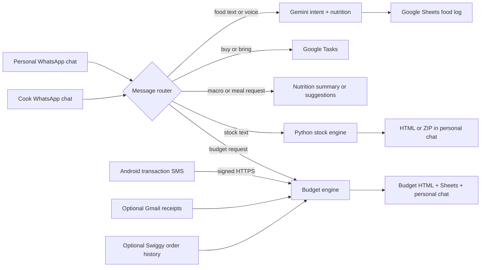

# 🥗📈💰 WhatsApp Personal Agent

<div align="center">

**Log meals, maintain a shopping list, get nutrition guidance, generate stock reports, and understand monthly spending — by messaging yourself on WhatsApp.**


</div>

---

## What is this?

This is a personal assistant that runs on a Windows computer or a persistent Linux cloud VM and watches **new messages** in two chosen WhatsApp conversations:

- Your personal self-chat: the chat where you message yourself.
- An optional cook or household chat.

You talk to it in normal English or Hindi. There are no slash commands to memorize. Depending on what you say, it can:

- estimate a meal's serving size and nutrition, then save it to Google Sheets;
- add things you want to buy to Google Tasks;
- summarize today's macros;
- suggest five personalized vegetarian meal options;
- generate an HTML stock-analysis report for one ticker or a complete configured list;
- build a categorized monthly spending report using transaction SMS, optional Gmail receipts, and optional Swiggy order details.

> [!IMPORTANT]
> **One copy of the agent must remain online.** In the local setup, the computer must stay on and `npm start` must keep running. In the cloud setup, Docker restarts the agent automatically on the VM. The agent reads only messages created after it becomes ready; it does not process old WhatsApp history.

> [!CAUTION]
> This is a private, local automation project, not an official WhatsApp product. It uses `whatsapp-web.js`, so WhatsApp Web changes can occasionally break it. Nutrition values are estimates, and stock reports are research aids—not medical or investment advice.

## Table of contents

- [Use cases and WhatsApp commands](#use-cases-and-whatsapp-commands)
- [How it works](#how-it-works)
- [Before you begin](#before-you-begin)
- [Complete Windows setup](#complete-windows-setup)
- [Android SMS and monthly-budget setup](#android-sms-and-monthly-budget-setup)
- [Swiggy order-history setup](#swiggy-order-history-setup)
- [Free cloud deployment](#free-cloud-deployment)
- [Architecture and decision log](ARCHITECTURE_DECISIONS.md)
- [Starting and stopping the agent](#starting-and-stopping-the-agent)
- [Schedules](#schedules)
- [Local PowerShell commands](#local-powershell-commands)
- [Troubleshooting](#troubleshooting)
- [Privacy, storage, and safe GitHub use](#privacy-storage-and-safe-github-use)

### Already configured? Start here

Open PowerShell in the project folder and run:

```powershell
npm start
```

Wait for `Agent is online!`, keep the terminal open, and use the messages in the [quick command card](#quick-command-card). No companion desktop script is needed.

---

## Use cases and WhatsApp commands

These are natural-language examples, not rigid magic words. Similar wording should also work.

### Quick command card

| What you want | Where to send it | Text or voice? | Recommended message | What happens |
|---|---|---:|---|---|
| Log food | Personal or cook chat | Both | `2 servings of poha for breakfast` | Gemini estimates portions/macros, writes the rows to `Sheet1`, and confirms in the personal chat. |
| Log a food with no quantity | Personal or cook chat | Both | `chana and paneer chaat` | A realistic standard serving is inferred and logged. |
| Log something being prepared | Personal or cook chat | Both | `Make paneer and two rotis for dinner` | Preparation/cooking language is treated as food being consumed and logged. |
| Add shopping tasks | Personal or cook chat | Both | `Buy paneer, milk and bread` | One item per Google Task is created; confirmation goes to the personal chat. |
| Show today's macros | **Personal only** | Both | `Macro summary` | Today's Sheet rows are summarized against the configured goal. |
| Suggest a meal | **Personal only** | Both | `Suggest me a dinner meal` | Five vegetarian suggestions are generated using today's food and the nutrition goal. |
| Report one stock | **Personal only** | **Text only** | `Stock report for AMD` | The Python engine generates and attaches one HTML report. |
| Report all configured stocks | **Personal only** | **Text only** | `Stock report of the day` | Every ticker in `TICKER_INPUT` is processed; a ZIP or the HTML reports are attached. |
| Current monthly budget | **Personal only** | Both | `Budget for the month` | A WhatsApp summary and HTML report are returned after SMS coverage is verified. |
| Create or change a budget category | **Personal only** | Text | `Put restaurant and food-stall merchants under Eating Out in this month's budget` | The constrained rule is saved for that month and the existing report is regenerated, or the next report uses it. |

### Food logging rules

Send any recognizable food, ingredient, dish, beverage, or prepared meal:

```text
paneer
chana and paneer chaat for breakfast
2 rotis and dal
one coffee
make 2 servings of poha
aaj dinner mein dal chawal banana
```

The agent estimates quantity, calories, protein, carbohydrates, fat, and fiber. If you name a meal such as breakfast or dinner, that meal is used; otherwise the current India time determines it.

### Shopping-task rules

Buying language has higher priority than food logging:

```text
buy paneer
bring milk and bread
get some onions
dudh le aana
vegetables kharidna
```

These messages **do not log the food as eaten**. They create entries such as `Buy paneer` in the default Google Tasks list. A request containing both food and words such as *buy*, *bring*, *purchase*, *order*, *get*, or *pick up* is treated as shopping.

### Personal-chat-only commands

```text
macro summary
what did I eat today?
nutrition report

suggest lunch
what should I eat for dinner?
kya khau?

stock report for TSLA
run analysis for $AAPL
stock report of the day
give all stock reports

budget for the month
where did my money go this month?
is mahine ka kharcha batao

budget for this month and put restaurant merchants under Eating Out
categorize Bottle Lab under Office Cafe in this month's budget
clear my custom budget categories for this month
```

Macro summaries, meal suggestions, stock reports, and budgets are intentionally ignored in the cook chat. Food logging and shopping tasks work in both configured chats. When a food or shopping command comes from the cook chat, its confirmation is sent privately to `PERSONAL_CHAT_ID`.

#### Budget privacy guardrail

Budget access fails closed unless `PERSONAL_CHAT_ID` is explicitly set to a direct `@lid` or `@c.us` chat. Budget requests from the cook chat, groups, or any unrelated chat are ignored; recognizable text requests are rejected before Gemini is called, and voice-derived budget intent is rejected after classification. On-demand status, summaries, HTML attachments, scheduled reports, failures, and Swiggy reauthorization notices are always delivered to the configured personal chat. Budget attachments never use `REPORT_PUBLIC_BASE_URL`, even when stock reports do.

If `PERSONAL_CHAT_ID` is missing, invalid, or identifies the same direct chat as `COOK_CHAT_ID`, the monthly budget schedule stays disabled and the startup log explains why. The encrypted SMS/order files and Google Sheet tabs remain trusted storage surfaces, so protect the VM and Google account permissions as described in [Privacy, storage, and safe GitHub use](#privacy-storage-and-safe-github-use).

### What is currently not supported?

- Stock commands sent as voice notes. Use a text stock request.
- Stock reports from the cook chat.
- Budgets from a WhatsApp Payments chat. There is no Payments chat integration; WhatsApp is only the command and delivery channel.
- Direct Zomato, Zepto, Ownly, or BigBasket order-history scraping. Their payment merchants can still be categorized from SMS, and Gmail receipts may provide item details.
- Bypassing a news paywall, login, robots restriction, or provider rate limit. Stock sentiment uses accessible public headline/feed metadata and optional authorized APIs; a Bloomberg or Investing.com headline can receive a high source-quality score when it is visible through a public feed, but the agent does not break into the article body.
- Cash spending that never appears in SMS, Gmail, or another configured source.

---

## How it works



### The important separation

| System | What it is used for |
|---|---|
| WhatsApp | Receiving commands and delivering confirmations/reports. |
| Gemini | Understanding natural language and voice, estimating food nutrition, generating meal suggestions, and classifying unresolved merchant names. |
| Google Sheets | Storing food rows and structured budget rows. |
| Google Tasks | Storing shopping reminders. |
| Python/Yahoo market data | Core market data, valuation, technical calculations, and HTML stock reports. |
| Public market-evidence feeds | Relevant headline metadata, source-weighted sentiment, corroboration, and current-year analyst-target evidence without paywall bypass. |
| Android SMS companion | Supplying filtered, redacted transaction alerts for the monthly budget. |
| Gmail, optional | Read-only receipt lookup for item-level budget enrichment. |
| Swiggy, optional | Read-only Food/Instamart order details matched to an existing payment. |

Gemini does **not** control budget amounts. SMS/receipt parsing, incoming-credit removal, refund handling, and duplicate reconciliation are deterministic. Gemini may classify an extracted merchant name or explicitly visible receipt item, but it cannot alter the amount, direction, or total.

For stocks, Gemini Search is only one analyst-source adapter. Yahoo headline metadata and public RSS/JSON feeds now provide a separate crawler path. Relevant evidence is scored using publisher quality, an optional reviewed author reputation, company/ticker relevance, freshness, independent corroboration, and noise penalties; near-duplicate headlines do not receive extra votes. That evidence is combined with trend, moving averages, 3/6/12-month momentum, and RSI to produce a separate `STRONG SELL` / `SELL` / `HOLD` / `BUY` / `STRONG BUY` market-sentiment signal with confidence and coverage. Individual analyst actions must be dated in the current calendar year and include a public source URL; missing targets remain `N/A` rather than being guessed. The current rolling Yahoo consensus is labelled separately from those YTD action rows.

The stock report now keeps two numbers intentionally separate. The **Independent Fair Value** comes only from the valuation models. The **Evidence-Calibrated 12-Month Objective** starts with that independent value and may apply a strictly capped analyst-consensus influence. Current-year targets use one latest vote per firm, implausible targets and statistical outliers are removed, and wider disagreement reduces their weight. A rolling provider consensus is used only as a lower-confidence fallback. This prevents one stale target, a duplicated firm, or an analyst-data outage from controlling the result.

Cross-listed shares and ADRs are normalized before valuation. For example, when a US-listed ADR trades in USD but its company files statements in TWD, the engine converts monetary statement values and revenue estimates using an explicit market FX rate and derives the quote-equivalent share count from market capitalization divided by the ADR price. If the required FX rate is unavailable, affected inputs are omitted and confidence is capped instead of mixing currencies silently.

The v9.1 stock engine also aligns FY0 and FY+1 estimates to the actual date twelve months from the report. This matters because MU's August fiscal year-end and TSM's December fiscal year-end require very different interpolation weights. Annual EPS is checked against period-matched current/next-quarter EPS and revenue: a quarter-corroborated HBM margin regime is allowed, while a malformed annual margin is transparently shrunk to the evidence envelope. Revenue and EPS analyst coverage are weighted separately, dual-listed peers receive one issuer vote, and disagreement among DCF/P-E/enterprise-value methods reduces weight and confidence without changing the raw displayed method values.

Primary economics and secondary AI exposure are separate. The primary valuation families include leading/mature foundries; diversified DRAM/HBM/NAND and NAND flash; wafer-fab equipment; process control; OSAT packaging; packaging equipment; automated test equipment; probe/test interfaces; burn-in testing; photonics; networking; critical power/cooling; distributed on-site power; electrical/grid equipment; power construction; merchant generation; and regulated utilities. TSM therefore remains a foundry while still showing advanced packaging as a secondary CoWoS/SoIC exposure. AMKR/ASE remain OSATs, TER/COHU remain test-equipment companies, FORM remains a test-interface company, Bloom remains distributed power, and VRT/ETN/GEV/PWR no longer share one incompatible peer basket.

Gemini quota failure therefore no longer removes all analyst discovery: public-feed target headlines can still be extracted conservatively, and the engine makes at most one target-focused grounded request per ticker while trying the configured model fallbacks on retryable quota or availability failures. Core market data, valuation, technical analysis, HTML generation, and the deterministic sentiment fallback remain independent of Gemini. Thin or unavailable public evidence is shown as a low-confidence technical-only fallback, not as false precision.

---

## Before you begin

### You will need

- A Windows 10 or Windows 11 computer.
- A WhatsApp account and phone.
- A Google account.
- [Node.js 24 LTS or later](https://nodejs.org/en/download). [Node 20 reached end of life](https://nodejs.org/en/about/eol) and no longer receives security fixes.
- [Python 3.10 or later](https://www.python.org/downloads/windows/). Python 3.12 is tested.
- [Brave Browser](https://brave.com/download/) installed at:

  ```text
  C:\Program Files\BraveSoftware\Brave-Browser\Application\brave.exe
  ```

- A [Gemini API key](https://aistudio.google.com/apikey).
- For monthly budgets: an Android 8+ phone, the companion app, and [Tailscale](https://tailscale.com/download).

### PowerShell, not Git Bash

All commands below are for **Windows PowerShell**. Open the project folder in File Explorer, right-click an empty area, and select **Open in Terminal**.

Do not copy the visible prompt characters such as `PS C:\...>` or `$`; copy only the command inside each code block.

---

## Complete Windows setup

Follow these steps in order. Optional sections are clearly marked.

### 1. Download the project

Using Git:

```powershell
git clone https://github.com/ayushbhaimehta/whatsApp-agent.git
Set-Location .\whatsApp-agent
```

If you downloaded a ZIP instead, extract it, open the extracted folder in PowerShell, and confirm that `package.json` is visible:

```powershell
Test-Path .\package.json
```

Expected result:

```text
True
```

### 2. Check required software

```powershell
node --version
npm --version
py -3 --version
Test-Path "C:\Program Files\BraveSoftware\Brave-Browser\Application\brave.exe"
```

You should see Node 24+, npm, Python 3, and `True` for Brave. If `py` is not recognized, reinstall Python and select **Add Python to PATH**, or later set `PYTHON_EXECUTABLE` in `.env`.

### 3. Install dependencies and run tests

```powershell
npm ci
py -3 -m pip install --upgrade pip
py -3 -m pip install -r .\requirements.txt
npm test
npm run test:stock
```

Do not continue until both test commands report zero failures. They use mocks/fixtures and do not send real WhatsApp messages or fetch live market feeds.

### 4. Create the local configuration file

```powershell
Copy-Item .\.env.example .\.env
notepad .\.env
```

For the first core startup, set SMS and Swiggy to `false`; they will be enabled after their own setup sections:

```dotenv
GEMINI_API_KEY=replace_with_your_gemini_key
SPREADSHEET_ID=replace_with_your_google_sheet_id
GOOGLE_APPLICATION_CREDENTIALS=./service-account.json

COOK_CHAT_ID=
PERSONAL_CHAT_ID=
USER_GOAL="Daily target: 2000 calories, 130g protein, 180g carbs, 65g fat. Goal is muscle building and staying fit."

GOOGLE_CLIENT_ID=replace_with_your_google_oauth_client_id
GOOGLE_CLIENT_SECRET=replace_with_your_google_oauth_client_secret

SMS_INGESTION_ENABLED=false
SWIGGY_ORDER_HISTORY_ENABLED=false
MONTHLY_BUDGET_INR=
```

Do not add spaces around `=`. Never paste a real secret into `.env.example`; only edit `.env`.

### 5. Create the Gemini API key

1. Open [Google AI Studio → API Keys](https://aistudio.google.com/apikey).
2. Create a key in a Google Cloud project you control.
3. Copy it into `GEMINI_API_KEY` in `.env`.
4. Keep it private. Do not paste it into GitHub, screenshots, or chat messages.

The same environment key is inherited by the Node nutrition agent and the Python analyst-enrichment code.

### 6. Configure Google Cloud

This project uses two different Google authentication methods:

- A **service account** writes to one Google Sheet.
- Your **personal OAuth consent** adds Google Tasks and optionally reads Gmail receipts.

#### 6A. Enable the APIs

1. Open the [Google Cloud API Library](https://console.cloud.google.com/apis/library).
2. Create or select one project.
3. Search for and enable:
   - **Google Sheets API**
   - **Google Tasks API**
   - **Gmail API** — needed only for optional receipt enrichment

#### 6B. Create the service-account key for Sheets

1. Open [IAM & Admin → Service Accounts](https://console.cloud.google.com/iam-admin/serviceaccounts).
2. Click **Create service account**.
3. Give it a name such as `whatsapp-agent-sheets`.
4. For this personal setup, no broad project role is required; click **Done**.
5. Open the new service account → **Keys** → **Add key** → **Create new key** → **JSON**.
6. Move the downloaded file into the project folder and rename it exactly:

   ```text
   service-account.json
   ```

7. Open that JSON file locally and copy only its `client_email` value. You will share the spreadsheet with that address in the next step.

> [!WARNING]
> If this repository is inside OneDrive, Dropbox, or another synchronized folder, storing `service-account.json` beside the code may copy it to that cloud account even though Git ignores it. Prefer moving the JSON to a private folder under `%LOCALAPPDATA%\WhatsAppFoodAgent\secrets\` and setting `GOOGLE_APPLICATION_CREDENTIALS` to its full Windows path.

For example, after moving it, replace the earlier relative setting with the actual path shown on your computer:

```dotenv
GOOGLE_APPLICATION_CREDENTIALS=C:\Users\your-name\AppData\Local\WhatsAppFoodAgent\secrets\service-account.json
```

Google's explanation of service accounts and direct document sharing is available in the [Workspace credential guide](https://developers.google.com/workspace/guides/create-credentials).

#### 6C. Create the Google Sheet

1. Open [sheets.new](https://sheets.new).
2. Leave the first tab named exactly `Sheet1`.
3. Put this header row in cells `A1:H1`:

   | A | B | C | D | E | F | G | H |
   |---|---|---|---|---|---|---|---|
   | Timestamp | Item | Quantity | Calories | Protein | Carbs | Fat | Fiber |

4. Click **Share** and add the service account's `client_email` as **Editor**. Disable notification because a service account has no inbox.
5. Copy the spreadsheet ID from its URL. It is the text between `/d/` and `/edit`:

   ```text
   https://docs.google.com/spreadsheets/d/THIS_PART_IS_THE_ID/edit
   ```

6. Paste it into `SPREADSHEET_ID` in `.env`.

The budget tabs—`BudgetTransactions`, `BudgetItems`, and `BudgetRuns`—are created automatically on the first successful budget report. An optional tab named `Goal` can contain key/value goal information; `USER_GOAL` in `.env` is simpler for beginners.

#### 6D. Create the OAuth client for Tasks and Gmail

1. Open [Google Auth Platform](https://console.cloud.google.com/auth/overview).
2. Configure the app name, support email, and audience.
3. If the app is in **Testing**, add your own Gmail address under **Test users**.
4. Open **Clients** → **Create client** → **Web application**.
5. Add both exact authorized redirect URIs:

   ```text
   http://localhost:3000/oauth2callback
   http://localhost:3001/oauth2callback
   ```

6. Copy the client ID and secret into `GOOGLE_CLIENT_ID` and `GOOGLE_CLIENT_SECRET` in `.env`.

> [!NOTE]
> In Google's External/Testing mode, consent tokens for scopes beyond basic profile access can expire after seven days. If Google Tasks later reports `invalid_grant`, rerun its authorization command. See Google's [app-audience documentation](https://support.google.com/cloud/answer/15549945).

### 7. Authorize Google Tasks

Shopping commands require this step:

```powershell
npm run auth:tasks
```

1. Copy the URL printed in the terminal into a browser on this Windows computer.
2. Sign into the account whose Google Tasks list you want to use.
3. Approve the Tasks permission.
4. Wait for the terminal to report success.

The resulting `google-tasks-token.json` is private and ignored by Git.

### 8. Optionally authorize Gmail receipts

This improves budget itemization when merchants email detailed receipts. It is **not required** for nutrition, tasks, stocks, or SMS-based budget totals.

```powershell
npm run auth:budget
```

Open the printed URL, select the Gmail account containing receipts, and approve read-only access. The agent cannot send, edit, or delete email through this grant.

### 9. Link WhatsApp and discover the chat IDs

Start the core app for the first time:

```powershell
npm start
```

On first use, a QR appears in the terminal and is also saved as `.whatsapp-qr.png`.

On the phone:

1. Open WhatsApp.
2. Open **Linked devices**.
3. Tap **Link a device**.
4. Scan the QR shown by the computer.
5. Wait until the terminal prints:

   ```text
   Agent is online! Watching for NEW messages only...
   ```

Now send one new message to your personal self-chat and one to the intended cook chat. The terminal prints records similar to:

```text
[WhatsApp sent] chatId=123456789@lid ...
[WhatsApp received] chatId=123456789-123456789@g.us ...
```

You can also inspect the latest events with:

```powershell
Get-Content .\chat-events.log -Tail 20
```

Copy the exact IDs, including `@lid`, `@c.us`, or `@g.us`, into `.env`:

```dotenv
PERSONAL_CHAT_ID=exact_personal_chat_id
COOK_CHAT_ID=exact_cook_chat_id
```

Press `Ctrl+C` once to stop the first run. Restart later after finishing the optional budget and Swiggy sections.

> [!TIP]
> The agent can sometimes detect the self-chat for non-budget features, but budget access and its schedule deliberately require the exact logged `PERSONAL_CHAT_ID`. Set it explicitly before startup.

### 10. Configure and test stock reports

Open [`gemini-code.py`](./gemini-code.py), find `TICKER_INPUT`, and replace the comma-separated symbols with the batch you want:

```python
TICKER_INPUT = "AMD, MSFT, GOOG"
```

Test one ticker locally:

```powershell
npm run report -- AMD
```

The report is written under `reports\`. A newly generated report from this revision ends in `_v9_1.html`; a `_v8_3.html` or `_v9_0.html` file is an older calculation and means the running machine/container has not been rebuilt from the latest code. If Python auto-detection fails, add an explicit path to `.env`:

```dotenv
PYTHON_EXECUTABLE=C:\Users\your-name\AppData\Local\Programs\Python\Python312\python.exe
```

Optional stock settings:

```dotenv
FMP_API_KEY=
STOCK_GEMINI_MODELS=
STOCK_REPORT_TIMEOUT_MINUTES=180
REPORT_PUBLIC_BASE_URL=
MARKET_SENTIMENT_LOOKBACK_DAYS=120
MARKET_REDDIT_ENABLED=true
MARKET_GDELT_ENABLED=true
# Optional reviewed author/analyst reputation, from 0.0 to 1.0. Do not assign
# a high score merely because an account is popular.
MARKET_AUTHOR_REPUTATION_JSON={"exact analyst or handle":0.90}
# Optional official X API bearer token. Leave blank to skip X completely.
MARKET_X_BEARER_TOKEN=
```

Leave `STOCK_GEMINI_MODELS` blank to use the tested fallback list. It controls only the optional grounded analyst-target search; Yahoo/public evidence and every valuation calculation continue without it.

`MARKET_REDDIT_ENABLED=false` disables the low-weight public Reddit RSS adapter, and `MARKET_GDELT_ENABLED=false` disables GDELT. X is queried only through its official recent-search API when `MARKET_X_BEARER_TOKEN` is configured; there is no hidden Twitter/X login or page scraping. Social authors receive a meaningful boost only when the feed identifies the author and that exact author is present in your reviewed `MARKET_AUTHOR_REPUTATION_JSON`; otherwise social posts stay low weight. Publisher weights and every accepted headline's final weight are visible in the HTML report.

The auditable evidence metric is `(30% publisher quality + 10% reviewed author score + 25% ticker/company relevance + 15% freshness + 20% independent corroboration) × (1 − noise penalty)`. Near-duplicate headlines are reduced to one voting item. With at least three well-covered items, news supplies 68% of the combined signal and technicals 32%; thin evidence uses 50/50, and no qualifying news produces an explicitly low-confidence technical-only result. To give a specific analyst such as Serenity additional social-source weight, add only the exact feed handle after you have reviewed its track record, for example `MARKET_AUTHOR_REPUTATION_JSON={"@serenity":0.90}`. The agent never assumes that popularity equals accuracy.

Without `REPORT_PUBLIC_BASE_URL`, WhatsApp sends the HTML or ZIP as a document attachment. That is the normal setup; public web hosting is not required.

---

## Android SMS and monthly-budget setup

The monthly budget requires a recent, complete scan of the current month's transaction SMS. Windows cannot directly read Android's protected SMS database, so the small companion app filters messages on the phone and uploads only likely, redacted transaction alerts.

### What leaves the phone?

The companion scans the current India-time month in memory. It excludes ordinary conversations, messages from blank/unknown/ordinary phone-number senders, OTPs, promotions, pending/failed payments, balance notices, due notices, self-transfers, and order-status-only messages. A message must contain an INR amount **and** evidence of a completed debit, payment, purchase, withdrawal, transfer, or refund; vague text that merely says “transaction” or “UPI” is not enough. It redacts phone numbers, account/card details, UPI IDs, and transaction references before upload.

There are four independent privacy boundaries:

1. **On the phone:** non-transaction SMS is rejected before the network client is called.
2. **At ingestion:** the Node service repeats the strict filter, schema checks, HMAC verification, timestamp check, and replay protection. It then encrypts accepted records with AES-256-GCM before writing them to disk.
3. **In the budget parser:** amounts, direction, refunds, duplicates, and totals are calculated locally. Gemini is not allowed to edit those fields.
4. **At the Gemini boundary:** an unresolved SMS contributes only a random-looking hashed row ID and the already-extracted, sanitized merchant candidate. The SMS body, sender, amount, timestamp, account/card data, UPI ID, and payment reference are not included in that prompt.

This protects what is transmitted and sent to Gemini, but Android still has to grant the companion `READ_SMS` so it can perform the local filtering. If you do not accept that device permission boundary, disable SMS ingestion and revoke/uninstall the companion; a complete SMS-based budget cannot then be produced.

### 1. Enable the desktop SMS receiver

Generate the shared secret:

```powershell
npm run setup:sms
```

The command prints a 64-character value and stores it outside the project at:

```text
%LOCALAPPDATA%\WhatsAppFoodAgent\secrets\sms-ingestion-secret.txt
```

Copy the displayed value temporarily; you will enter it once in the Android app. Running the command again reuses the existing secret instead of silently rotating it.

Update `.env`:

```dotenv
SMS_INGESTION_ENABLED=true
SMS_INGESTION_HOST=127.0.0.1
SMS_INGESTION_PORT=8787
SMS_SCAN_MAX_AGE_HOURS=12
```

Do **not** paste the secret into `.env`; the desktop reads the protected secret file automatically.

### 2. Install Tailscale on Windows and Android

Tailscale privately gives the phone an HTTPS route to the local Windows receiver.

On Windows, open **PowerShell as Administrator** and run:

```powershell
winget install --id Tailscale.Tailscale -e
```

Open Tailscale and sign in. On Android, install the official Tailscale app, sign into the **same account/tailnet**, approve the VPN prompt, and leave it connected.

Restart PowerShell after installing. If `tailscale` is still not recognized, use its full path:

```powershell
$tailscale = "$env:ProgramFiles\Tailscale\tailscale.exe"
& $tailscale status
```

### 3. Start the agent and verify the local receiver

```powershell
npm start
```

Keep this terminal open. Wait for all relevant startup lines:

```text
Agent is online! Watching for NEW messages only...
Stock report schedule active...
Monthly budget schedule active...
Android transaction SMS ingestion is listening at http://127.0.0.1:8787/v1/sms/transactions.
```

Open a **second PowerShell** and run:

```powershell
Invoke-RestMethod http://127.0.0.1:8787/health
```

Expected response:

```text
ok   service
--   -------
True sms-ingestion
```

### 4. Expose only that local port through Tailscale Serve

In the second PowerShell:

```powershell
$tailscale = "$env:ProgramFiles\Tailscale\tailscale.exe"
& $tailscale serve --bg http://127.0.0.1:8787
& $tailscale serve status
```

If it says **Serve is not enabled on your tailnet**, open the exact approval URL printed by the command in a desktop browser, enable Serve, and run the two commands again.

The status output shows an address similar to:

```text
https://your-computer.your-tailnet.ts.net
```

That line is an example. **Do not type the placeholder literally.** Copy the exact HTTPS address shown on your own computer.

Test it first in desktop PowerShell and then in the phone's browser while Tailscale is connected:

```powershell
Invoke-RestMethod "https://YOUR-EXACT-TAILSCALE-HOST/health"
```

Tailscale's official documentation explains [Serve](https://tailscale.com/docs/reference/tailscale-cli/serve) and its persistent `--bg` mode. Use **Serve**, not public Funnel.

### 5. Build or locate the Android APK

On this existing workstation, an already-built APK may be present at:

```text
android-sms-companion\dist\SMS-Budget-Companion-debug.apk
```

Check:

```powershell
Test-Path .\android-sms-companion\dist\SMS-Budget-Companion-debug.apk
```

The APK is intentionally ignored by Git, so a fresh GitHub clone may return `False`. In that case, install Android Studio with Android SDK 35 and JDK 17, open `android-sms-companion`, and choose **Build → Build APK(s)**, or build from PowerShell:

```powershell
Set-Location .\android-sms-companion
.\gradlew.bat :app:testDebugUnitTest :app:assembleDebug
Set-Location ..
```

The generated APK will be:

```text
android-sms-companion\app\build\outputs\apk\debug\app-debug.apk
```

Read the companion's [full Android guide](./android-sms-companion/README.md) before installing it.

### 6. Install the APK

You can copy the APK to your phone and open it, or install it through Android Debug Bridge. Only install an APK you built yourself or obtained from a repository you trust. Do not permanently disable Play Protect.

For ADB installation:

1. Enable Android **Developer options** and **USB debugging** temporarily.
2. Connect the phone by USB and unlock it.
3. Run from the repository root:

   ```powershell
   $adb = "$env:LOCALAPPDATA\Android\Sdk\platform-tools\adb.exe"
   Test-Path $adb
   & $adb devices
   & $adb install -r ".\android-sms-companion\dist\SMS-Budget-Companion-debug.apk"
   ```

4. Accept the **Allow USB debugging** RSA dialog on the phone.
5. Success looks like:

   ```text
   Performing Streamed Install
   Success
   ```

If you built the APK rather than using `dist`, replace the last path with:

```text
.\android-sms-companion\app\build\outputs\apk\debug\app-debug.apk
```

After installation, USB debugging, Developer options, and **Install unknown apps** can be turned off. Do not revoke the companion's SMS permission if you want automatic budget synchronization.

### 7. Configure the Android companion

Open **SMS Budget Companion** and follow this exact order:

1. Read and tick the consent disclosure.
2. In **HTTPS upload endpoint**, enter:

   ```text
   https://YOUR-EXACT-TAILSCALE-HOST/v1/sms/transactions
   ```

   Use the exact host from `tailscale serve status`, not `/health` and not a placeholder.

3. Paste the exact shared secret printed by `npm run setup:sms`.
4. Tap **Save secure configuration**.
5. Tap **Grant SMS access** and approve both requested SMS permissions.
6. Allow background activity or unrestricted battery use for this app if your phone offers that setting.
7. Tap **Sync current month now**.

`Current-month SMS scan queued` means Android has queued background work; it does not mean the upload has completed yet. Keep internet and Tailscale connected, wait, then place the app in the background and reopen it. Success is a new timestamp beside **Last completed full scan**.

Only after that timestamp appears, send this in the personal WhatsApp chat:

```text
Budget for the month
```

### 8. Normal monthly use

You do not reinstall or reconfigure anything next month:

1. Keep the phone connected to Tailscale. For a local installation, keep Windows connected and `npm start` running. For cloud, confirm `docker compose ps` shows the agent running; no local `npm start` is needed.
2. Open the companion and tap **Sync current month now** if the last scan is more than 12 hours old.
3. Wait for **Last completed full scan** to update.
4. Send `Budget for the month` to your personal self-chat.

The Android app also attempts a full current-month scan after new SMS and about every six hours, but phone battery management can delay background work. A manual sync shortly before the scheduled report on the 26th is the safest option.

> [!WARNING]
> The companion can scan only the **current** India-time month. If a previous month never received a sufficiently complete checkpoint near that month's end, the app cannot reconstruct that missing checkpoint later.

---

## Swiggy order-history setup

Swiggy enrichment is optional. Budget totals still work from SMS when it is disabled. The integration uses Swiggy's official read-only MCP endpoints; it does not scrape the consumer website and locally refuses cart, checkout, payment, or order-placement tools. The commands immediately below are for the local Windows setup; cloud authorization is covered in the cloud guide.

Stop `npm start` with `Ctrl+C`, set this in `.env`, and authorize:

```dotenv
SWIGGY_ORDER_HISTORY_ENABLED=true
```

```powershell
npm run auth:swiggy
```

Complete both Swiggy Food and Instamart phone/OTP flows in the browser. Wait for:

```text
Swiggy authorization is complete. The regular agent can now sync in the background.
```

Then restart the agent:

```powershell
npm start
```

Important limitations:

- Swiggy access currently needs renewal roughly every five days. When the agent sends a reauthorization reminder, rerun `npm run auth:swiggy`.
- Instamart exposes only a rolling recent-order window, so leave the agent running regularly if you want continuous item history.
- A Swiggy order is attached only when it uniquely matches an existing payment. Unmatched orders never create new spending or alter totals.
- Food history is best effort, depending on what Swiggy returns for the account.

---

## Free cloud deployment

The repository now includes a Linux/ARM64-compatible Docker image, persistent runtime paths, automatic container restart, a cloud preflight check, and a secure Tailscale layout. The recommended zero-hosting-cost target is an Oracle Cloud Ampere A1 Always Free Ubuntu VM. Gemini and other APIs retain their own quotas or possible charges.

Vercel is not suitable for this application because WhatsApp Web needs one continuously running Chromium process and persistent session storage; stock jobs can also outlive a serverless request. AWS can run the container, but its current free offer is temporary rather than an ongoing free VM.

Follow the **[complete Oracle Cloud deployment guide](CLOUD_DEPLOYMENT.md)**. It includes every Windows and Ubuntu command, credential migration, remote Google/Swiggy authorization, WhatsApp QR pairing, Android companion changes, Tailscale Serve, updates, encrypted backup/restore, and zero-hosting-cost safeguards.

If Oracle signup or capacity is unavailable, use the **[complete AWS Free Plan deployment guide](AWS_FREE_DEPLOYMENT.md)**. The same container runs on an EC2 `t4g.small` without application changes. AWS is easier to provision but is a temporary free option: the current T4g promotion ends on December 31, 2026, and a new AWS Free account plan ends after six months or when its credits are exhausted.

After cloud cutover, stop the Windows copy. Running local and cloud listeners together can process the same message twice.

For a ground-up explanation of every module, data flow, security boundary, package choice, deployment decision, alternative, and extension pattern, read the **[complete architecture and decision log](ARCHITECTURE_DECISIONS.md)**.

---

## Starting and stopping the agent

### Local Windows: start everything

From the repository root:

```powershell
npm start
```

That one command starts:

- the headless WhatsApp Web session;
- new-message routing;
- food logging, tasks, summaries, and suggestions;
- stock report processing and schedule;
- budget processing and schedule;
- Android SMS ingestion, when enabled;
- Swiggy startup/daily synchronization, when enabled.

Wait for `Agent is online!`. The WhatsApp session normally runs without opening a visible browser. A browser or QR is needed only for first-time/recovery authorization.

### Local Windows: stop everything

Click the terminal running the agent and press:

```text
Ctrl+C
```

Do not start a second copy while the first is running. Two copies compete for the same WhatsApp browser profile and cause a `browser is already running ... .wwebjs_auth\session` error.

### AWS EC2: connect, start, stop, and view logs

There are two different terminals in this process. Run the first command in
**Windows PowerShell**. Run all Docker commands only after you are connected to
the **EC2 Ubuntu terminal**.

#### 1. Connect to EC2 from Windows PowerShell

Replace the example IP address if the EC2 public IP has changed:

```powershell
ssh -i "$env:USERPROFILE\.ssh\aws-whatsapp-agent" ubuntu@15.135.169.83
```

When the prompt changes to something similar to
`ubuntu@ip-172-31-42-228:~$`, you are inside EC2.

#### 2. Start the agent on EC2

```bash
cd ~/whatsApp-agent
docker compose --env-file .env.cloud up -d agent
docker compose --env-file .env.cloud ps
```

The `-d` option leaves the agent running in the background after the command
finishes. In the `ps` result, the `agent` service should show as `Up` or
`running`.

If you have just pulled new code, rebuild the image and recreate the container:

```bash
cd ~/whatsApp-agent
git pull --ff-only origin master
docker compose --env-file .env.cloud up -d --build --force-recreate agent
```

#### 3. Check the logs

Show the latest 200 log lines and return to the prompt:

```bash
cd ~/whatsApp-agent
docker compose --env-file .env.cloud logs --tail=200 agent
```

Watch new log lines continuously:

```bash
cd ~/whatsApp-agent
docker compose --env-file .env.cloud logs -f --tail=100 agent
```

Press `Ctrl+C` to leave the live log viewer. This does **not** stop the agent;
it continues running in the background.

#### 4. Stop or restart the agent

Stop it intentionally:

```bash
cd ~/whatsApp-agent
docker compose --env-file .env.cloud stop agent
```

Start the same stopped container again:

```bash
cd ~/whatsApp-agent
docker compose --env-file .env.cloud start agent
```

Restart a running agent:

```bash
cd ~/whatsApp-agent
docker compose --env-file .env.cloud restart agent
```

To shut down and remove the Compose container and network, while keeping the
bind-mounted `cloud-data` folder:

```bash
cd ~/whatsApp-agent
docker compose --env-file .env.cloud down
```

For normal stopping, prefer `stop agent`. Do not add `-v`, run a volume-pruning
command, or delete `cloud-data`; that directory contains the persistent
WhatsApp session, secrets, SMS data, reports, and logs.

#### 5. Confirm that the services are healthy

```bash
cd ~/whatsApp-agent
docker compose --env-file .env.cloud ps
curl http://127.0.0.1:8787/health
cat cloud-data/status/agent-status.json
```

The health URL becomes available after the agent has initialized its SMS
receiver. The status file shows the current WhatsApp lifecycle state.

The Compose restart policy starts the container again after an ordinary VM
reboot unless you intentionally stopped it. Typing `exit` only closes the SSH
connection; it does not stop the background agent. Never leave the Windows and
EC2 copies running together because both copies can process the same message.

### Check current status

```powershell
Get-Content .\.agent-status.json
Get-Content .\chat-events.log -Tail 20
```

The audit log contains every newly received or sent message before chat filtering, which makes chat-ID discovery easy.

---

## Schedules

| Job | India time | Destination | Requirement |
|---|---|---|---|
| Complete stock batch | Monday–Friday at 6:00 PM | Personal WhatsApp chat | Agent process/container online, WhatsApp ready, and Python available. |
| Monthly budget | 26th of every month at 6:00 PM | Personal WhatsApp chat | Agent online and a recent complete SMS scan. |
| Missed budget catch-up check | At minute 5 of every hour | Personal WhatsApp chat | Agent online; persisted once-per-month state and retry rules apply. |
| Swiggy order sync | Startup and daily at 3:10 AM | Encrypted local cache | Agent online and current Swiggy authorization. |
| Swiggy pre-budget sync | Immediately before each budget | Encrypted local cache | Same as above; failure falls back safely to existing sources/cache. |

These are in-memory schedules inside the one Node agent process; there is no separate OS cron, Windows Scheduled Task, or second daemon. If the local process or cloud container is offline, the job cannot execute at that moment.

The budget scheduler checks hourly for a missed eligible run. A failed scheduled attempt becomes eligible again after a six-hour cooldown. A new installation does not unexpectedly backfill the already-missed report for its installation month.

---

## Local PowerShell commands

Run these from the repository root:

| Command | When to use it |
|---|---|
| `npm start` | Start the entire agent. This is the only long-running command. |
| `npm test` | Run the mocked/unit test suite without sending WhatsApp messages. |
| `npm run test:stock` | Run the offline Python stock-intelligence tests without live web calls. |
| `npm run auth:tasks` | First-time Google Tasks connection or `invalid_grant` recovery. |
| `npm run auth:budget` | Optional read-only Gmail receipt authorization. |
| `npm run auth:swiggy` | First-time or expired Swiggy Food/Instamart authorization. |
| `npm run setup:sms` | Create or reveal the Android/desktop shared SMS secret. |
| `npm run report -- AMD` | Generate one stock report locally without WhatsApp. Replace `AMD` with a ticker. |
| `Get-Content .\.agent-status.json` | Check whether WhatsApp is loading, ready, waiting for QR, or failed. |
| `Get-Content .\chat-events.log -Tail 20` | Find recent chat IDs and audit events. |
| `Invoke-RestMethod http://127.0.0.1:8787/health` | Test the local SMS endpoint while the ready agent is running. |

---

## Budget categories in plain English

The report has two different kinds of categories:

1. **Payment-channel category**: what kind of merchant received the payment.
2. **Item category**: what was actually bought when itemized data exists.

Examples:

| Evidence | Category behavior |
|---|---|
| Swiggy, Zomato, Ownly, EatClub payment | `Online food` |
| Zepto, Instamart, Blinkit, BigBasket, Flipkart Minutes payment | `Online delivery` |
| Bottle Lab payment | `Office cafeteria` |
| Ayush Mehta transfer | `Ayush transfers`; shown separately and excluded from budget spend |
| Tata Payments payment | `Credit card payment`; shown separately and excluded to prevent counting the card bill twice |
| A person's name | `Transfers`, unless a safer deterministic merchant rule applies |
| Foreign-currency posting with INR debit evidence | `Forex` |
| Poha item | Its own `Poha` item category |
| Vegetables, paneer, yogurt, dal, milk, bread, rice, atta | `Essential grocery` when evidenced in an online-delivery order |
| Protein bar, Diet Coke, chips, delivery snacks | `Online delivery` item category |
| Other restaurant dishes | `Online food` item category |
| Name with no reliable meaning | `Miscellaneous` |

The agent never invents an item breakdown from a payment total. Essentials versus snacks appear only when a receipt or order source provides real line items.

Duplicate debit alerts require the same exact amount and compatible evidence within narrow time windows. Refunds are reconciled separately. Transfers and Forex are not merged using amount/time alone.

---

## Troubleshooting

### `npm start` prints only the Google Tasks line

WhatsApp has not reached `ready` yet, so schedules and SMS ingestion have not started. Wait for a QR, loading message, or specific error, then inspect:

```powershell
Get-Content .\.agent-status.json
```

### `The browser is already running for ... .wwebjs_auth\session`

Another agent process or orphaned Brave process is using the same WhatsApp session.

1. Return to the terminal where the first agent runs and press `Ctrl+C`.
2. Wait a few seconds and retry `npm start`.
3. If you cannot find the process, inspect matching processes before stopping anything:

   ```powershell
   Get-CimInstance Win32_Process |
     Where-Object { $_.CommandLine -like '*wwebjs_auth*' } |
     Select-Object ProcessId, Name, CommandLine
   ```

Do not delete `.wwebjs_auth` unless you intentionally want to unlink WhatsApp and scan a new QR.

### Personal-chat messages are logged but ignored

The configured ID probably differs from WhatsApp's current `@lid`/`@c.us` representation. Copy the exact `chatId=` from `chat-events.log` into `PERSONAL_CHAT_ID`, stop with `Ctrl+C`, and restart.

Remember: only messages sent **after** `Agent is online!` are processed.

### A cook-chat macro, meal suggestion, stock, or budget gets no reply

That is intentional. Those features are personal-chat-only. Cook chat supports only food logging and shopping tasks.

### A voice note is not processed

- Send a new PTT/audio voice note after the ready message.
- Keep the phone and computer online until WhatsApp finishes uploading it.
- Retry once if WhatsApp reports an empty media download.
- Confirm the message belongs to one of the two configured chats.
- Voice understanding requires an available Gemini model/quota.

### Gemini returns `429` or `503`

- `429` normally means the project/model quota or rate limit was reached.
- `503` normally means temporary model capacity pressure.
- The agent retries transient failures and tries its configured fallback model.
- Nutrition intent, voice understanding, meal suggestions, and macro wording depend on Gemini and may be temporarily unavailable.
- Core stock market data, valuation calculations, technical analysis, and HTML generation still work; only optional analyst-search enrichment may be reduced.
- Budget monetary totals remain deterministic; unresolved merchant enrichment may fall back to `Miscellaneous`.

Check usage and quota in [Google AI Studio](https://aistudio.google.com/).

### Google Tasks reports `invalid_grant`

```powershell
npm run auth:tasks
```

Approve access again, then resend the shopping message. Testing-mode OAuth grants may expire after seven days.

### Swiggy asks for authorization again

```powershell
npm run auth:swiggy
```

Complete both browser phone/OTP flows. A shutdown-time `AbortError` after a successful authorization is harmless in older output; current code suppresses that cosmetic message.

### `Invoke-RestMethod: command not found`

You are probably in Git Bash rather than PowerShell. Open PowerShell, or use this Bash equivalent:

```bash
curl http://127.0.0.1:8787/health
```

### `tailscale` is not recognized

```powershell
$tailscale = "$env:ProgramFiles\Tailscale\tailscale.exe"
& $tailscale status
```

### Tailscale says `Serve is not enabled on your tailnet`

Open the exact enablement URL printed by Tailscale in a desktop browser signed into the same account. Approve Serve, then rerun:

```powershell
& "$env:ProgramFiles\Tailscale\tailscale.exe" serve --bg http://127.0.0.1:8787
& "$env:ProgramFiles\Tailscale\tailscale.exe" serve status
```

### Local `/health` fails

Make sure the agent printed its WhatsApp-ready and SMS-listening lines. Check whether anything is listening without killing a process:

```powershell
Get-NetTCPConnection -LocalPort 8787 -State Listen -ErrorAction SilentlyContinue
```

### Android says `Current-month SMS scan queued` forever

WorkManager is asynchronous.

1. Keep the agent running.
2. Keep Tailscale connected on both devices.
3. Give the companion unrestricted/background battery permission.
4. Make sure automatic date/time and timezone are enabled on both devices.
5. Wait, background the companion, then reopen it to refresh **Last completed full scan**.

If there is still no timestamp, verify `/health`, re-save the exact endpoint and secret, and sync again.

### Budget says SMS coverage is missing or stale

Keep the agent online (`npm start` locally or the Docker container in cloud), tap **Sync current month now**, wait for a new completed-scan timestamp, and resend:

```text
Budget for the month
```

### A merchant has no item breakdown

A payment SMS usually contains only the merchant and total. The agent does not guess items or divide a total. Connect Gmail receipts and Swiggy order history when available; other merchant categories can still work without itemization.

### Custom monthly budget categories

From `PERSONAL_CHAT_ID` only, you can add a rule while requesting a report or correct an already-generated report:

```text
Budget for this month; put restaurants and food stalls under Eating Out
Categorize Bottle Lab as Office Cafe in this month's budget
Move existing Misc food transactions into Eating Out for August 2026
Clear my custom budget categories for this month
```

Rules are scoped to the requested month and saved in private runtime storage. A rule may match exact sanitized merchant names, an existing built-in category, or one of a bounded set of merchant types such as restaurant/food business, grocery, transport, health, utility, or person transfer. Gemini converts the request to that constrained schema and, when semantic matching is needed, sees only hashed merchant IDs and sanitized merchant names. It never receives an SMS body, sender, amount, timestamp, account/card field, UPI ID, or payment reference for this operation. Category rules can change grouping and labels only; they cannot change amounts, refund direction, deduplication, or monthly totals.

### Python is not found

```powershell
py -3 --version
```

If that fails, install Python. If Python exists somewhere unusual, set its full path in `.env` as `PYTHON_EXECUTABLE=...`.

---

## Privacy, storage, and safe GitHub use

### Where data is stored

| Data | Windows local / cloud VM location | Retention |
|---|---|---|
| Food and budget rows | Your configured Google Sheet | Until you delete them. |
| Google Tasks | Your default Google Tasks list | Until you complete/delete them. |
| WhatsApp session | `.wwebjs_auth\` / `cloud-data/whatsapp-auth/` | Until unlinked or deleted. |
| Google Tasks token | `google-tasks-token.json` / `cloud-data/secrets/google-tasks-token.json` | Until revoked/deleted. |
| Gmail OAuth token | `%LOCALAPPDATA%\WhatsAppFoodAgent\google-budget-token.json` / `cloud-data/secrets/google-budget-token.json` | Until revoked/deleted. |
| Filtered transaction SMS cache | `%LOCALAPPDATA%\WhatsAppFoodAgent\budget-data\android-sms.enc.jsonl` / `cloud-data/budget-data/android-sms.enc.jsonl` | Encrypted, append-only; no automatic pruning currently. |
| SMS scan checkpoints | `%LOCALAPPDATA%\WhatsAppFoodAgent\budget-data\android-sms-scan-state.json` / `cloud-data/budget-data/android-sms-scan-state.json` | Latest 24 device/month checkpoints. |
| Budget HTML/JSON | `%LOCALAPPDATA%\WhatsAppFoodAgent\budget-reports\` / `cloud-data/budget-reports/` | One pair per month; no automatic deletion. |
| Swiggy normalized order cache | `%LOCALAPPDATA%\WhatsAppFoodAgent\budget-data\` / `cloud-data/budget-data/` | Encrypted; automatically pruned to 90 days. |
| Monthly custom category rules | `%LOCALAPPDATA%\WhatsAppFoodAgent\budget-data\category-rules.json` / `cloud-data/budget-data/category-rules.json` | Private file, scoped by month; until cleared/deleted. |
| Swiggy OAuth state | `%LOCALAPPDATA%\WhatsAppFoodAgent\secrets\swiggy-mcp-auth\` / `cloud-data/secrets/swiggy-mcp-auth/` | Until expired/replaced/deleted. |
| Stock reports | `reports\` / `cloud-data/stock-reports/` | Until manually deleted. |
| WhatsApp audit log | `chat-events.log` / `cloud-data/logs/chat-events.log` | Append-only; no automatic rotation currently. |

The audit log records up to 500 characters of every new message plus chat/message identifiers, including messages outside the two configured feature chats. Protect it accordingly.

### Before pushing to GitHub

The `.gitignore` excludes common secrets and generated data, but Git ignore rules do not protect files that were committed previously, and they do not stop OneDrive from synchronizing local files.

Verify sensitive files are ignored:

```powershell
git check-ignore .env service-account.json google-tasks-token.json .wwebjs_auth chat-events.log
git status --short
```

Never commit or share:

- `.env`;
- `service-account.json`;
- `google-tasks-token.json`;
- Gmail or Swiggy OAuth files;
- `.wwebjs_auth`;
- SMS/budget caches;
- generated financial reports;
- API keys, OAuth secrets, GitHub tokens, or Tailscale credentials.

Do not put a GitHub access token inside the remote URL. Use a clean remote and let Git Credential Manager authenticate:

```powershell
git remote set-url origin https://github.com/ayushbhaimehta/whatsApp-agent.git
git remote -v
```

If a secret was ever committed or placed in a shared URL/log, removing the text is not enough—revoke or rotate that credential at its provider.

### Safely retire the Android integration

1. Untick consent in SMS Budget Companion.
2. Revoke its SMS permission in Android Settings.
3. Uninstall it or clear its app data.
4. Stop `npm start`.
5. Inspect `tailscale serve status` before removing only the Serve mapping you no longer need.
6. Delete local caches or Sheet rows only if you intentionally want permanent removal.

---

## First-run checklist

- [ ] `npm test` finishes with zero failures.
- [ ] `npm run test:stock` finishes with zero failures.
- [ ] `.env` contains the Gemini key, Sheet ID, and Google credentials.
- [ ] `Sheet1!A1:H1` contains the required headers.
- [ ] The Sheet is shared with the service-account email as Editor.
- [ ] `npm run auth:tasks` succeeds.
- [ ] WhatsApp prints `Agent is online!`.
- [ ] `PERSONAL_CHAT_ID` and `COOK_CHAT_ID` use exact logged IDs.
- [ ] `paneer for breakfast` creates a Sheet row.
- [ ] `buy milk` creates a Google Task.
- [ ] `macro summary` replies in the personal chat.
- [ ] `npm run report -- AMD` creates an HTML report.
- [ ] Optional Gmail and Swiggy authorization are complete.
- [ ] Android shows a recent **Last completed full scan**.
- [ ] `Budget for the month` returns a summary and HTML attachment.

Once these boxes pass, normal operation is simply:

```powershell
npm start
```

Keep that terminal open, and use WhatsApp normally.
